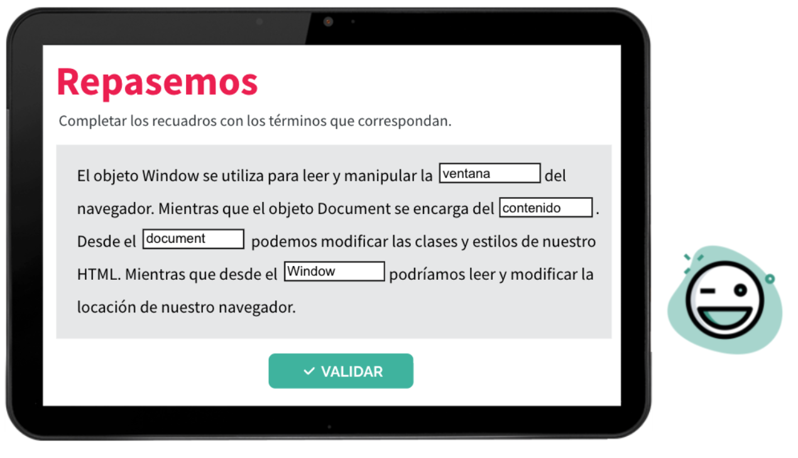

## Repaso final Front2


#### *Que hace var?*
Declara una variable global o en el ambito de una funcion.

#### *Que hace let?*
Declara una variable en el ambito de un bloque. 

#### *Que hace const?*
Declara una constante en el ambito de un bloque. 

#### *Tipos de variables*
``` let myVariable = "Hello World"; ``` es un String. </br>
``` let myVariable1 = 22; ``` es un number. </br>
``` let myVariable2 = false; ``` es un boolean. </br>
``` let myVariable3; ``` es un undefined. </br>
``` let myVariable4 = {nombre: 'mi nombre'}; ``` es un objeto let. </br>
``` let myVariable5 = null; ``` es un objeto(es un tipo de objeto especial). </br>
``` let myVariable6 = function(){let doSomething}; ``` es una function </br>

#### *Como se comprueban los tipos de variables?*
typeOf()

#### *Estructuras*
- ```if``` Permite ejecutar un bloque solo si se cumple una condicion dada.
- ```If...else``` Permite evaluar una condicion y ejecutar un bloque de codigo u otro. 
- ``` Switch``` Permite ejecutar diferentes acciones dependiendo del valor de una variable. 

#### *Bucles*
- _For_  Permite ejecutar repetitivamente un bloque de codigo. ```for(inicial;condicion;fina;)```
- _While_ se ejecuta hasta que la condicion sea verdadera ```while(condiicon){}```
- _Do... while_ Ejecuta un bloque de codigo mientras una condicion sea verdadera. A diferencia del while la condiicon se evalua al final de cada ejecucion. 
```do{...} while (condicion)```

#### *¿Qué combinación de teclas abre la consola del navegador?*
Ctrl, Shift + I, Además de F12. 

#### *¿Qué resultado obtengo si ejecuto el siguiente código? console.log(5+5)*
10

#### *Puedo crear una variable directamente en la consola.*
Verdadero

#### *La consola solo es visible para los usuarios que están logueados.* 
Falso

#### *A través de la consola puedo modificar páginas web.*
Verdadero

#### *¿Cuál es la función principal de la consola?*
Depurar páginas web.

#### *¿Puedo activar o desactivar la consola en mi sitio web?*
Jamás, es una herramienta del navegador.

#### *Al cerrar la consola pierdo todos los cambios que realicé en la misma.*
Falso

#### *Tipos de vinculacion de JS*
- Interna(incurstado en el HTML)
- Externa(en un archivo a parte)

#### *Formas de capturar datos*
- ```prompt()``` --> muestra un cuadro de diálogo con mensaje opcional, que solicita al usuario que introduzca un texto. 
- ```confirm()``` --> muestra un cuadro de diálogo con un mensaje opcional y dos botones, “Aceptar” y “Cancelar”. (Los datos capturados son true o false).

#### *¿Qué método de window usamos en JavaScript para que el usuario ingrese datos por teclado?*
prompt()

#### *Cuál es la diferencia entre alert y confirm?*
Con alert hay un botón para aceptar que el mensaje fue recibido, confirm hace una consulta al usuario y este decide por “Aceptar” o “Cancelar”.

#### *Si no completo un dato en prompt y pulso “Aceptar”, retorna por defecto una cadena de texto vacío.*
verdadero

#### *Los datos obtenidos con cualquiera de los métodos de window se almacenan automáticamente y se visualizan en consola.*
Falso

#### *¿Qué retorna un prompt() si el usuario presiona “Cancelar”?*
null

#### *¿Qué tipo de dato almacena un confirm()?*
booleano

#### *Que hace el parseInt()?*
Esta función parsea una cadena de texto y devuelve un número.

#### *Que hace el parseFloat()?*
Esta función parsea una cadena de texto y devuelve un número y los números decimales que existan.

#### *Que hace NaN?*
La propiedad NaN nos indica que el valor no es un número (Not A Number), por lo que esto nos produciría un error si queremos realizar alguna operación aritmética con este valor.

#### *Objeto Math()*
- Math.PI --> nos devuelve el numero de PI(3,14...)
- Math.random() --> Retorna un pto flotante, un numero pseudoaleatorio dentro del rango[0,1).
- Math.round() --> Retorna el valor de un numero redondeado al entero mas cercano.
- Math.max() --> Devuelve el mayor de cero o mas numeros. 

#### *Bucles especificos*
- ``for ... in ...`` --> for(var variedad in objeto)
- ``for... of...`` --> for(var variable of elemtneo iterable)

#### *JavaScript nos permite interactuar con el front-end del usuario siempre y cuando se haga una petición al servidor.*
Falso

#### *¿Qué es el DOM?*
La representación en objetos que hace JavaScript del documento HTML.

#### *El objeto window representa la ventana donde estamos navegando.*
Verdadero

#### *Mediante el objeto document podemos...*
Leer todos los elementos del HTML y modificarlos, si así lo quisiéramos.



#### *Selectores*
- `document.getElementById();` // el id es algo unico de cada elemento</br>
- `document.getElementsByClassName();` //devuelve un array de los elementos con la clase indicada </br>
- `document.getElementsByTagName("p");` //devuelve un array de todos los elementos con el tagname indicado </br>
- `document.querySelector("p");`// mas general puedo buscar cualquier cosa, depende de como lo escribo en los parametros, devuelve el primer elemento encontrado </br>
- `document.querySelectorAll("p"); `//devuelve un array con todos los elementos

#### *SelectoresDOM*
- `querySelector()`
```js
    let titulo = document.querySelecto('.title');
```
- `querSelectorAll()`
```js
    let nombres = document.querySelectorAll('.name');
```
- `getElementById()`
```js
    let marca = document.getElementById('marca');
```
comparando selectores:</br>
| querySelector()| querySelectorAll()| getElementById()|   
|----------------|-------------------|-----------------|
| Retorna el primer elemento del DOM que cumplecon la condicion que buscamos. | Retorna todos los elementos del DOM que cumplen con la condicion que buscamos. | Retorna el elemento del DOM que cumpla con el id que buscamos. |

#### *Modificaciones del DOM*
`document.querySelector()` es uno de los selectores que permite elegir que elemento se quiere modificar del DOM. </br>
La propiedad `.innerHTML` al ser utilizada para escritura reemplaza completamente lo que ya estaba, con el operando `+=` se agrega el contenido al que ya estaba. </br>
Con la propiedad `innerText` sirve para leer o modificar el texto de una etiqueta HTML.</br>
```js
    document.querySelector('div.nombre').innerText; //--> retorna lo que este escrito en ese elemento. 
    document.querySelector('div.nombre').innerText = 'Lara'; //--> reemplaza lo que estaba escrito por Lara, en este caso. 
    document.querySelector('div.nombre').innerText += 'Messi'; //--> agrega el Messi 
```

#### *Sintaxis correcta de un template string*
```"Mi variable vale ${miVariable}"``` --> se abre con las comillas invertidas`</br>
Ejemplo mas claro 
```js
const miNombre = "Lara";
const miTemplate = `mi nombre es ${miNombre}`;
console.log(miTemplate);
```

#### *Modificando clases con classList...*
| .add()                       | .remove()                      | .toggle()                                              | .contains()                                                            |
|------------------------------|--------------------------------|--------------------------------------------------------|------------------------------------------------------------------------|
| Agrega la clase  al elemento | Elimina la clase  del elemento | Agrega la clase en caso de no tenerla, sino la elimina | Pregunta si un elemento tiene la clase o no Retorna un valor booleano. |

</br>

#### *Creacion de nodos elemento*
`document.createElement("input");`

#### *Creacion de nodo texto*
`document.createTextNode("HOLIS");`

#### *Adherir un elemento hijo al DOM*
`document.body.appendChild(titulo);`

#### *Marcá la opción que describa correctamente el método createNodeText().*
createNodeText() = Podría ser una cadena de texto vacía, lleva comillas y no se visualiza hasta asignarlo a un elemento.


#### *appendChild solo asignará el elemento hijo si creamos antes el elemento padre con createElement.*
FALSO.

#### *El siguiente ejercicio da como resultado: un <p> con el texto “Buenos dias” dentro de un div*
```html
<script>
var p = document.createElement("P")
var texT = document.createTextNode("Buenos Dias");
p.appendChild(texT);
var diV = document.querySelector("div").appendChild(p);
document.body.appendChild(diV)
</script> 
```
VERDADERO

#### *Atributos dinamicos*
--> Etiqueta ``````
- alt
- src
- width</br>
--> Etiqueta ```</a>```
- href
- target</br>
--> Etiqueta ```<meta>```
- charset
- name

#### *Metodos de atributos* 
`hasAtributte()` --> evalua si contiene el atributo (retorna boolean)
`getAttribute()` --> revortna el elemento si existe o null si no
`removeAttribute()`--> elimina el atributo
`setAttribute()` --> agrega un atributo 

#### *Que evento permite que todo el script se ejecute cuando se haya cargado por completo el objeto document dentro del objeto window?*
```js
window.onload = function(){
    console.log("Se cargo el documento.");
}
```

#### *Que evento nos permite ejecutar una accion cuando se hace click sobre un elemento al cual le estamos aplicando una propiedad?*
```js
btn.onclick = function(){
    console.log("Se hizo click.");
}
```

#### *Para que sirve el preventDefault()?*
Nos permite evitar que se ejecute el evento predeterminado -o no nativo- del elemento al que se lo estamos aplicando.</br>
-->Evitar que el elemento ejecute el evento que trae por default para que podamos manipularlo antes.

#### *LISTA de eventos mas utilizados*
- `onlick` --> cuando se hace click.
- `ondblclick` --> cuando se hace soble click.
- `onmouseover` --> cuando el mouse se mueve sobre el elemento.
- `onmousemove` --> cuando se mueve el mouse.
- `onscroll` --> cuando se hace scroll.
- `onkeydown` --> cuando se aprieta una tecla.
- `onload` --> cuando se carga la pagina.
- `onsubmit`--> cuando se envia un dormulario.

#### *Eventos del mouse*
- `mouseOver`
- `mouseOut`

#### *Eventos del teclado*
- `onkeydown`
- `onkeyup`
- `onkeypress`

#### *¿Cuál de todas las propiedades de un evento de teclado es la que almacena el valor de la tecla presionada?*
key

#### *forms*


#### *El evento blur sirve para...*
detectar que el usuario quitó el cursor de un input del formulario.

#### *El evento focus sirve para...*
detectar que el usuario situó el cursor en un input del formulario.

#### *El evento change sirve para..*
detectar cambios en el valor de un input.

#### *Si utilizáramos el atributo href de location sobre la URL: https://www.youtube.com/results?search_query=peaky+blinders, ¿qué obtendríamos??*
https://www.youtube.com/results?search_query=peaky+blinders

#### *¿Qué método del objeto location permite recargar el sitio?*
location.reload();

#### *Si utilizáramos el atributo location.search de la URL: https://www.youtube.com/results?search_query=peaky+blinders, ¿qué obtendríamos?*
search_query=peaky+blinders

#### *Si estamos en la URL: https://www.youtube.com/results?search_query=peaky+blinders, y teniendo en cuenta el código: "let query = new URLSearchParams(location.search)", ¿qué devolvería si implementáramos el método query.get(search_query)?*
peaky+blinders

#### *Metodos json*
```js
JSON.parse()// = JSON --> JS
JSON.stringify()//=JS--> JSON
```
#### *local vs session storage*
| session storage                                                               | local storage                                                           |
|-------------------------------------------------------------------------------|-------------------------------------------------------------------------|
| Guarda informacion en sesion (Si se cierra el navegador se pierde)            | Los datos almacenados no  tienen fecha de expiracion.                   |
| sessionStorage.setItem() sessionStorage.getItem() sessionStorage.removeItem() | localStorage.setItem() localStorage.getItem() localStorage.removeItem() |
</br>

#### *¿Cuál es la diferencia entre sessionStorage y localStorage?*
localStorage permite almacenar información por tiempo indeterminado y sessionStorage, no.

#### *El método .setitem() de localStorage, ¿qué nos permite realizar?*
Agregar valores asociados a una key en localStorage.

#### *El método .removeitem() de sessionStorage, ¿qué nos permite realizar?*
Remover valores asociados a una key en el sessionStorage.

#### *El método .clear() de localStorage, ¿qué nos permite realizar?*
Borrar todo el contenido de localStorage.

#### *¿Cuál de las siguientes es una de las características de sessionStorage?*
Los datos se borran al cerrar la ventana del navegador.

#### *Que es AJAX????*
AJAX (Asynchronous JavaScript and XML) es un conjunto de tecnologías que se utilizan para crear aplicaciones web asíncronas. Esto las vuelve más rápidas y con mejor respuesta a las acciones del usuario.

#### *Como funciona AJAX?*
Pasos de el accionar ajax:</br>
1. Se produce un evento en una página web (se carga la página, se hace clic en un botón)
2. JavaScript crea un objeto XMLHttpRequest
3. El objeto XMLHttpRequest envía una solicitud a un servidor web
4. El servidor procesa la solicitud.
5. El servidor envía una respuesta a la página web.
6. La respuesta es leída por JavaScript.
7. JavaScript realiza la acción adecuada (como la actualización de la página).

#### *Caracteristicas del protocolo HTTP*
Los mensajes HTTP forman una estructura como medio para realizar una petición de datos iniciada por el cliente, normalmente un navegador web, en busca de su respuesta ejecutada por el servidor.</br>
El protocolo HTTP es extensible, esto significa que con el tiempo se ha permitido que se implementen más funciones de control y funcionalidad sobre la Web: caché o métodos de identificación o autenticación.

#### *tipos de asincronismo*
- Concurrencia: cuando las tareas pueden comenzar, ejecutarse y completarse en períodos de tiempo superpuestos, en donde al menos dos hilos están progresando
- Paralelismo: cuando dos o más tareas se ejecutan exactamente al mismo tiempo.

#### *Diferencias entre concurrencia y el paralelismo*
La diferencia entre la concurrencia y el paralelismo está en que, en el primer caso, no implica que las tareas terminen de ejecutarse al mismo tiempo literalmente como sí ocurre en el segundo caso. Además, decimos que JavaScript es un lenguaje no-bloqueante porque las tareas no se quedan bloqueadas esperando a que finalicen evitando proseguir con el resto de tareas.

#### *Metodos de peticion: (REQ)*
`GET` -->solicitar datos
`POST` --> enviar/ crear un dato
`DELETE` --> reemplazar un dato
`PUT` --> modificar parcialment un dato
`PATCH` --> borrar un dato

#### *promesas* 
objeto que nos permite decidir si recibo o no lo que estoy esperando </br>
`resolve`--> si se cumple</br>
`reject` --> si no se cumple</br>
`then`--> para la respuestas favorables (positivas)</br>
`catch` --> ocurre si hay un error 

## *Hacer repaso de los sgtes temas:*

#### *rest*

#### *fetch*

#### *get*

#### *Manejo de errores con try, catch y finally*

#### *fetch-post*

